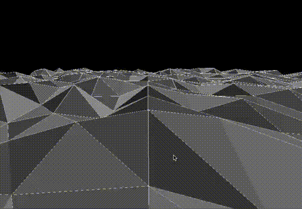

# RAV4 Animation
This code contains a three.js implementation of the startup screen from my Toyota RAV4.
It's basically an infinite flyover of wire-mesh terrain and the mouse pans the camera.

## Run It
`npx vite` should build and then start a dev server.
